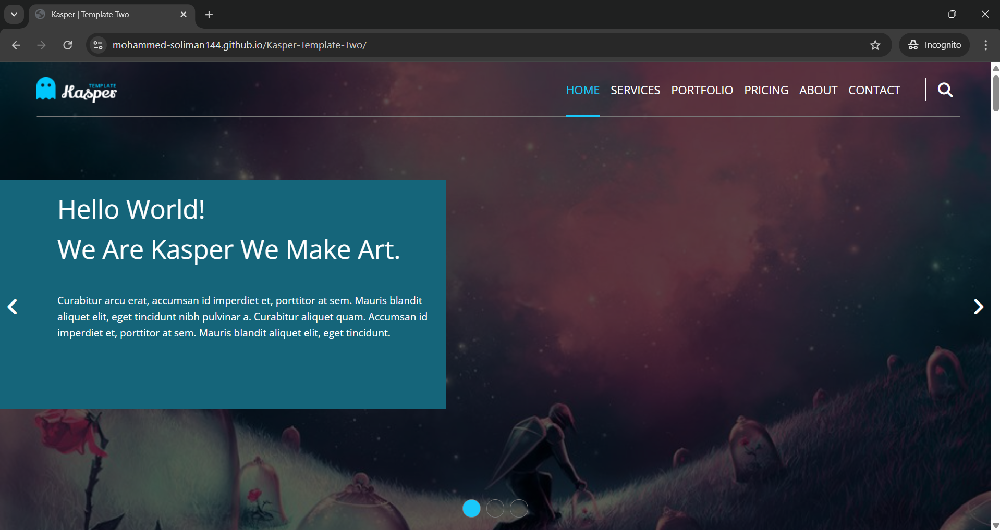

# Kasper-Template-Two



Interactive and Responsive Landing Page

---

## Live Demo

**[View Live Demo Here](https://mohammed-soliman144.github.io/Kasper-Template-Two/)**

---

## Features:

**1-Responsive Design:** Works seamlessly on desktops, tablets and smart phones.

**2-Interactive UI:** Filter Images, Change Image Slider, Generate Random Text, Validating Form, Open Mail Application To Send Subscribe Email, Change Images and Text when Screen Touch for Smart Phones, Smoothly Scrolling and More Others.

---

## Technologies Used:

**1-HTML5**

**2-CSS3**

**3-JAVASCRIPT (ES6+)**

---

### How To Run Locally:

**Clone The Repo:**

```bash command
git clone https://github.com/mohammed-soliman144/Kasper-Template-Two.git
```

**Navigate To The Project Directory:** `bash command cd Kasper-Template-Two`

**Open 'index.html'** in your browser.

---

### Author:

**Mohammed Soliman**

**[Github Profile](https://github.com/mohammed-soliman144)**

**[Business Email](mohammed-soliman144@gmail.com)**

---

## License:

This Project is Licensed under the MIT License.

